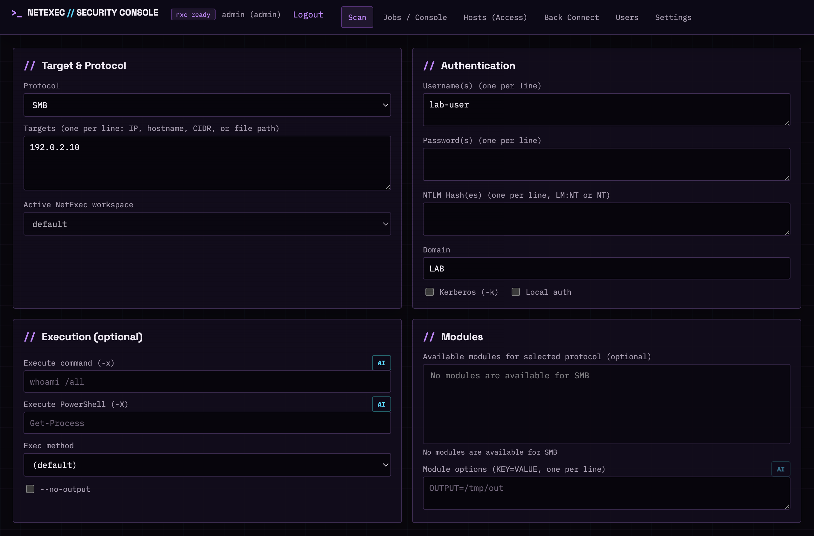
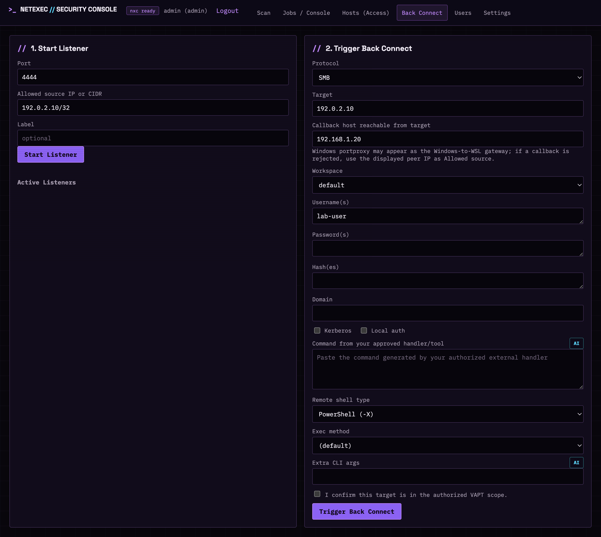

# NetExec Security Console

[](https://github.com/rungga/nxc-web-console/actions/workflows/test.yml)

> Stable release (`1.0.0`) for local, single-process use in authorized security labs. Review [deployment limitations](#deployment-limitations) before exposing the console beyond loopback.

NetExec Security Console is an independent community web interface for authorized [NetExec](https://github.com/Pennyw0rth/NetExec) assessments. It is not an official NetExec project and is not affiliated with or endorsed by the NetExec maintainers.

Use this software only on systems you own or are explicitly authorized to assess.

## Application preview

The examples below use documentation-only addresses and contain no live credentials or assessment data.



## Requirements

- Python 3.12
- `uv` (recommended) or Python `venv`/`pip`
- A separately installed, working NetExec `nxc` executable
- Lima on macOS when native NetExec files are blocked by endpoint protection

Run the local console:

```bash
./run.sh
```

Open `http://127.0.0.1:8000`. The first startup prints a generated administrator password once. That password is temporary: after login, only **Settings** is available until a new password is set.

Keep the first-run password private. There is intentionally no shared default password such as `P@ssw0rd`. Runtime authentication data, signing keys, job history, and redacted logs are stored under `~/.nxc-webgui` by default and must never be committed.

### Password recovery

Reset an account interactively without placing the password in shell history:

```bash
./run.sh reset-password
./run.sh reset-password --username analyst
```

A reset credential must be changed after the next login. For a controlled automation account, this can be disabled explicitly:

```bash
./run.sh reset-password --username service-account --no-force-change
```

Passwords must contain at least 12 characters and use at least three of these classes: lowercase, uppercase, digits, and symbols.

## Platform support

- **macOS**: native `nxc` is preferred. The included Lima wrapper can use a separately provisioned `netexec-lab` VM.
- **Linux**: install NetExec natively and ensure `nxc` is available on `PATH`, or set `NXC_BIN` explicitly.
- **Windows**: not directly certified; WSL2 with a Linux NetExec installation is the expected path.

## WSL2 callback networking

The listener runs inside the WSL distribution. The authorized target must be able to reach the callback host and port shown in **Back Connect**. WSL mirrored mode is preferred on Windows 11 22H2 or newer.

### Mirrored mode

Create or update `%UserProfile%\.wslconfig`:

```ini
[wsl2]
networkingMode=mirrored
firewall=true
```

Restart WSL:

```powershell
wsl --shutdown
```

From an Administrator PowerShell session, allow only the callback port required by the authorized lab:

```powershell
New-NetFirewallHyperVRule `
	-Name "NxcWebConsoleCallback4444" `
	-DisplayName "NetExec Web Console callback 4444" `
	-Direction Inbound `
	-VMCreatorId "{40E0AC32-46A5-438A-A0B2-2B479E8F2E90}" `
	-Protocol TCP `
	-LocalPorts 4444
```

Start the console with an explicit listener interface. Prefer the specific interface address over all interfaces:

```bash
NXCWEB_LISTENER_BIND='<wsl-or-lan-interface-ip>' ./run.sh
```

### NAT mode

Default WSL2 NAT does not expose the private WSL address directly to LAN targets. Forward the Windows port to WSL from an Administrator PowerShell session:

```powershell
$Distro = "kali-linux"
$Port = 4444
$WslIp = ((wsl.exe -d $Distro hostname -I).Trim() -split '\s+')[0]

netsh interface portproxy delete v4tov4 listenport=$Port listenaddress=0.0.0.0
netsh interface portproxy add v4tov4 `
	listenport=$Port listenaddress=0.0.0.0 `
	connectport=$Port connectaddress=$WslIp

New-NetFirewallRule `
	-DisplayName "NetExec Web Console callback $Port" `
	-Direction Inbound -Action Allow -Protocol TCP -LocalPort $Port
```

Find the Windows LAN address with `ipconfig`, then start the console in WSL with explicit callback settings:

```bash
export NXCWEB_LISTENER_BIND="0.0.0.0"
export NXCWEB_CALLBACK_HOST="192.168.1.20"
export NXCWEB_CALLBACK_ALLOWED_SOURCE="$(ip route show default | awk '{print $3 "/32"; exit}')"
./run.sh
```

Replace `192.168.1.20` with the actual Windows LAN address. Binding to `0.0.0.0` is broad; use a specific WSL interface address where possible and enforce a narrow Windows firewall rule. The WSL address can change after restart, requiring the `portproxy` rule to be recreated.

The callback host remains editable in the browser for a one-off route. If **Active Listeners** shows `Last rejected callback`, set **Allowed source** to that displayed peer IP with a `/32` suffix. Microsoft documents current WSL networking behavior at <https://learn.microsoft.com/windows/wsl/networking>.

#### NAT mode application view

The **Back Connect** view shows the Windows-reachable callback host and warns when `portproxy` may change the peer address observed by WSL.



## NetExec runtime on macOS

The Web GUI requires the separate `nxc` executable. On this macOS host, NetExec runs in the dedicated Lima instance `netexec-lab` because host endpoint protection removes source files required by NetExec. The launcher probes native executables first and uses `bin/nxc-lima` only when the guest runtime passes `nxc --version`.

Guest state is persisted under `~/.nxc-lima/home/.nxc`; the Web GUI reads the same workspace databases through that mounted path. Start the console normally:

```bash
./run.sh
```

Useful runtime checks:

```bash
limactl list netexec-lab
./bin/nxc-lima --version
```

Use only authorized targets. Lima uses a NAT network, so `127.0.0.1` inside NetExec refers to the guest VM; use `host.lima.internal` when an authorized target is a service on this Mac.

The Lima VM and NetExec runtime are not bundled in this repository. The wrapper expects NetExec at `~/.local/bin/nxc` inside the `netexec-lab` guest and persists guest state through the host mount `~/.nxc-lima`.

## AI Assistant

AI Assistant suggests bounded commands for execution, PowerShell, module option, CLI argument, and callback connectivity fields. Suggestions never execute automatically. The operator must select **Use suggestion** and still submit the surrounding form.

The assistant detects Bahasa Indonesia or English from the assessment goal and localizes suggestion titles, explanations, controls, and notices. Use the language selector in the dialog to override automatic detection when a short or mixed-language prompt is ambiguous.

The default `local` provider requires no network access or API key:

```bash
NXCWEB_AI_PROVIDER=local ./run.sh
```

Remote providers are configured only through server environment variables. API keys are never sent to the browser.

### OpenAI

```bash
export NXCWEB_AI_PROVIDER=openai
export NXCWEB_AI_MODEL='<model-id>'
# Load NXCWEB_AI_API_KEY from a secrets manager or a secure shell prompt.
./run.sh
```

### Anthropic Claude

```bash
export NXCWEB_AI_PROVIDER=anthropic
export NXCWEB_AI_MODEL='<model-id>'
# Load NXCWEB_AI_API_KEY from a secrets manager or a secure shell prompt.
./run.sh
```

### Google Gemini

```bash
export NXCWEB_AI_PROVIDER=gemini
export NXCWEB_AI_MODEL='<model-id>'
# Load NXCWEB_AI_API_KEY from a secrets manager or a secure shell prompt.
./run.sh
```

### OpenAI-compatible engine

Use this for a governed internal gateway or a local engine that implements Chat Completions:

```bash
export NXCWEB_AI_PROVIDER=openai-compatible
export NXCWEB_AI_BASE_URL='http://127.0.0.1:11434/v1'
export NXCWEB_AI_MODEL='<model-id>'
# Set NXCWEB_AI_API_KEY only when the endpoint requires it.
./run.sh
```

### Copilot gateway

Consumer GitHub Copilot sessions are not accessed directly. Use only an approved organization gateway that exposes an OpenAI-compatible Chat Completions API:

```bash
export NXCWEB_AI_PROVIDER=copilot
export NXCWEB_AI_BASE_URL='https://your-approved-gateway.invalid/v1'
export NXCWEB_AI_MODEL='<model-id>'
# Load NXCWEB_AI_API_KEY from an approved secrets manager.
./run.sh
```

Optional request settings:

```bash
NXCWEB_AI_TIMEOUT=20
```

The browser sends only the field type, protocol, selected module names, shell type, and the operator's short assessment goal. Targets and current field values are not included. Goals containing apparent passwords, hashes, tokens, or API keys are rejected. Remote output is schema-validated and commands matching destructive, credential-access, persistence, evasion, payload-staging, or reverse-shell patterns are discarded.

AI guardrails are a safety layer, not a security boundary. Review every suggestion before use.

## Security deployment

The built-in server binds to `127.0.0.1` and does not terminate TLS. For any non-loopback deployment:

1. Put the application behind an authenticated HTTPS reverse proxy.
2. Set `NXCWEB_COOKIE_SECURE=true`.
3. Set an explicit `NXCWEB_SECRET_KEY` through a secrets manager.
4. Restrict host and network access with a firewall.
5. Narrow the back-connect listener to loopback with `NXCWEB_LISTENER_BIND=127.0.0.1` unless external callbacks are required.

Back-connect listeners bind to all interfaces (`0.0.0.0`) by default, matching a manual `nc -l` listener, so authorized remote targets can call back without extra configuration. Each accepted TCP connection is still matched against the listener's `allowed_source` network and closed immediately if the peer does not match. Set `NXCWEB_LISTENER_BIND` to a specific interface address or `127.0.0.1` to narrow exposure further, and enforce the narrowest possible firewall allowlist.

## Environment variables

| Variable | Default | Purpose |
| --- | --- | --- |
| `NXCWEB_HOST` | `127.0.0.1` | Web server bind address |
| `NXCWEB_PORT` | `8000` | Web server port |
| `NXCWEB_DATA_DIR` | `~/.nxc-webgui` | Auth, job database, signing key, and redacted logs |
| `NXCWEB_COOKIE_SECURE` | `false` | Require HTTPS-only session cookies; set `true` beyond local HTTP |
| `NXCWEB_SECRET_KEY` | generated locally | Persistent session-signing secret |
| `NXCWEB_LISTENER_BIND` | `0.0.0.0` | Back-connect listener bind address; set `127.0.0.1` to restrict to loopback |
| `NXCWEB_CALLBACK_HOST` | route-detected | Callback address reachable from the target; commonly the Windows LAN IP in WSL NAT |
| `NXCWEB_CALLBACK_ALLOWED_SOURCE` | target `/32` | Source IP or CIDR accepted by listeners; a Windows gateway may be observed through `portproxy` |
| `NXCWEB_MAX_CONCURRENT_JOBS` | `5` | Maximum concurrent running/stopping jobs |
| `NXCWEB_MAX_RETAINED_JOBS` | `200` | Retained job history count |
| `NXCWEB_MAX_JOB_LOG_BYTES` | `20971520` | Per-job disk log limit |
| `NXCWEB_MAX_WS_CONNECTIONS_PER_USER` | `8` | Maximum concurrent WebSocket streams per authenticated user |
| `NXC_BIN` | auto-detected | Native `nxc` or an explicit wrapper path |
| `NXC_HOME` | `~/.nxc` | NetExec workspace/config root |
| `NXCWEB_AI_PROVIDER` | `local` | `local`, `openai`, `anthropic`, `gemini`, `openai-compatible`, or `copilot` |
| `NXCWEB_AI_MODEL` | empty | Remote provider model identifier |
| `NXCWEB_AI_BASE_URL` | provider default | Governed provider endpoint |
| `NXCWEB_AI_API_KEY` | empty | Provider secret; never expose it to the browser or Git |

## Deployment limitations

- No built-in TLS termination or production process supervisor.
- The SQLite job store and in-memory listeners are designed for a single application process.
- Active jobs and callback sessions do not recover across application restarts.
- macOS Lima setup is host-specific and not created automatically by this repository.
- The local AI provider is rules-based; remote model quality and availability depend on the configured provider.
- Broad cross-platform and high-concurrency deployments are not certified.

## Back-connect troubleshooting

Confirm the listener and inspect callback traffic inside WSL or Linux:

```bash
ss -lntp | grep ':4444'
sudo tcpdump -ni any tcp port 4444
```

- No SYN reaches Linux: verify the callback host, Windows forwarding, route, and firewall.
- `Last rejected callback` appears: **Allowed source** does not include the peer address observed by the listener.
- A session opens and immediately closes: the remote command or shell process exited.
- A trigger job fails: inspect **Jobs / Console** for the NetExec error.
- `Triggered` means NetExec started the command; it does not confirm that a callback connected.

## Development

```bash
cd backend
PYTHONPATH=. .venv/bin/python -m unittest discover -s tests -v
cd ..
node --check frontend/static/js/app.js
node --check frontend/static/js/api.js
bash -n run.sh bin/nxc-lima
```

See [CONTRIBUTING.md](CONTRIBUTING.md), [SECURITY.md](SECURITY.md), and [CHANGELOG.md](CHANGELOG.md).

## Attribution and license

This independent Web GUI calls NetExec as a separate runtime dependency and does not bundle its source or binaries. NetExec is maintained at [Pennyw0rth/NetExec](https://github.com/Pennyw0rth/NetExec) under the BSD 2-Clause License.

The Web GUI source in this repository is licensed under [BSD-2-Clause](LICENSE), Copyright (c) 2026 Rungga.